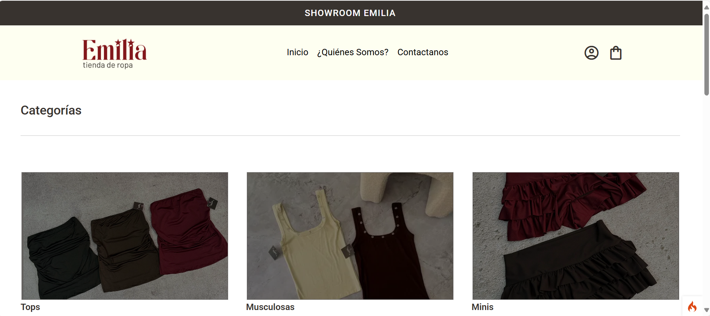
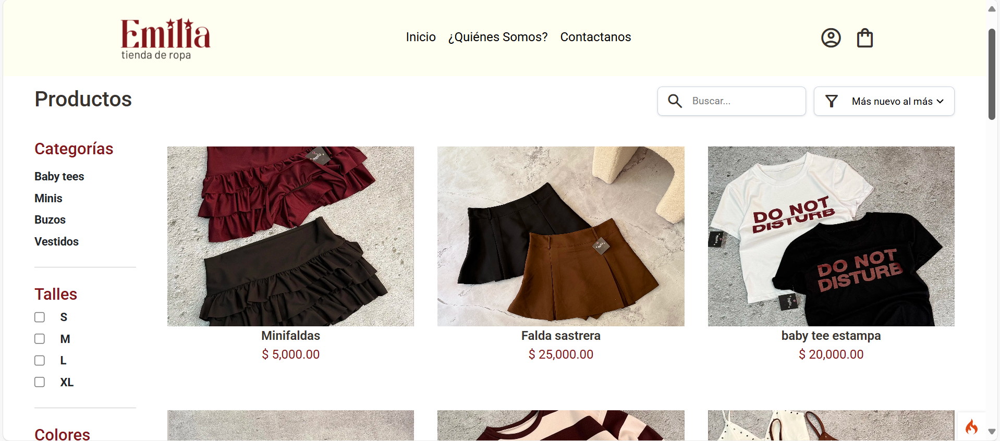
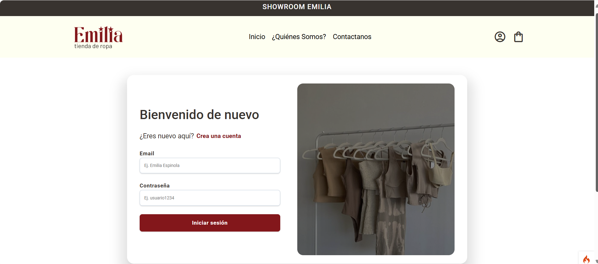
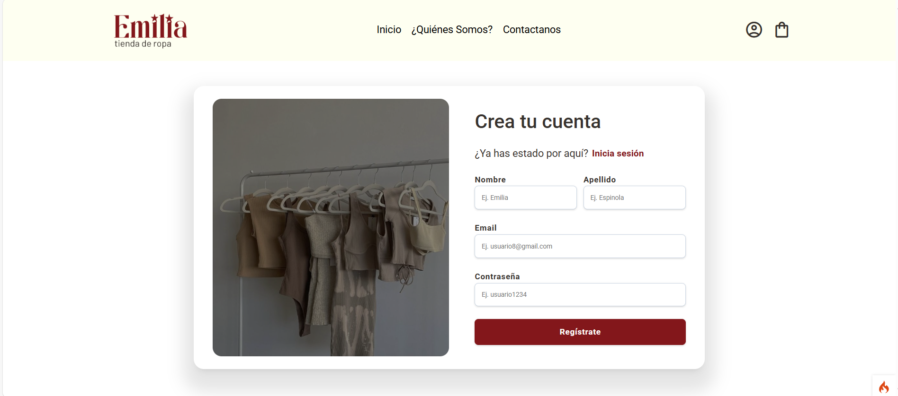
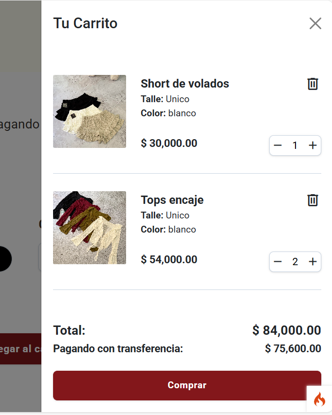
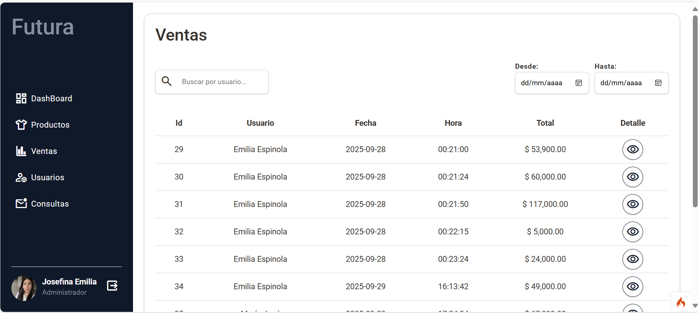

# 🛍️ Emilia - Tienda de ropas

Proyecto de una **tienda online de ropa** desarrollada con **CodeIgniter, PHP, HTML, CSS y JavaScript**.  
El sistema permite a los usuarios navegar, buscar y comprar prendas de manera sencilla y rápida.
También permite al administrador gestionar los productos y viazualizar las ventas.

---

## Tecnoligias usadas

  
  
  
  
 

---

## ✨ Características

- 👕 Gestión de productos (ropa por categorías, talles, colores).  
- 🔍 Búsqueda y filtrado de productos.  
- 🛒 Carrito de compras dinámico.    
- 👤 Registro e inicio de sesión de usuarios.  
- 📦 Panel de administración para administrar los productos, categorias, colores y talles.
- :money_with_wings: Visualizar las ventas.
- :computer: Administarar los usuarios y consultas.  

---

## 📸 Capturas 

## 🏠 Página Principal

## 👕 Todos los productos

## 👤 Iniciar sesión

## 👤 Registrarse

## 🛒 Carrito 

## :money_with_wings:  Ventas 

## Alta de productos 

## Añadir detalle al producto 

